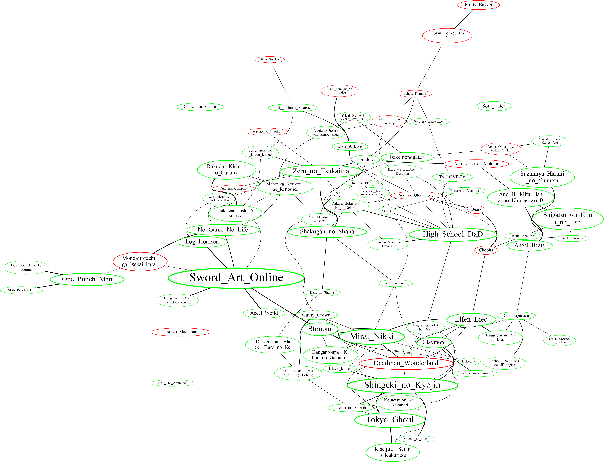

# MyAnimeList Recommendations

## Requirements

- os
- numpy
- subprocess
- graphviz
- Rignak_Misc
- Rignak_MAL_database

graphviz must be installed.

## Usage

``` 
>python Recommendation.py --help
NAME
    Recommendation.py - Create a graph based on the recommendations from MAL and the anime watched by the user

SYNOPSIS
    Recommendation.py USERNAME <flags>
    
DESCRIPTION
    Create a graph based on the recommendations from MAL and the anime watched by the user

POSITIONAL ARGUMENTS
    USERNAME
        name of the user, used for the coloration of the boxes

FLAGS
    --world_origin_index=WORLD_ORIGIN_INDEX
        anime index of the origin of the graph
    --world_origin_title=WORLD_ORIGIN_TITLE
        anime title of the origin of the graph
```

## Example

